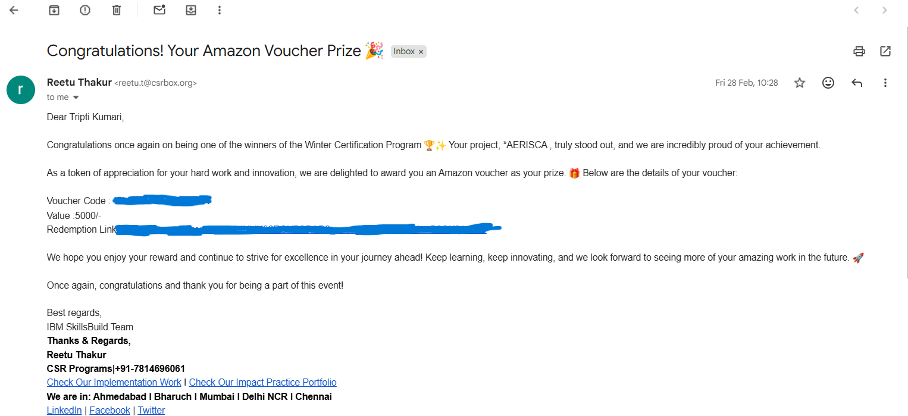

# AI-Powered Product Marketing Model – AERISCA

This project was developed as part of the **IBM SkillsBuild CSRBOX Winter Certification Program (Nov–Dec 2024)**. It demonstrates an **end-to-end AI-driven product marketing model** using multiple AI technologies, combining AI-assisted marketing, sentiment analysis, campaign planning, product design, and website deployment. The project was recognized as a **Top 5 finalist and winner**, and the team received an Amazon voucher for ₹5000.  

## Project Overview

**Objective:**  
Develop an AI-powered system to conceptualize, design, and market a new product, AERISCA, leveraging AI technologies and advanced prompt engineering techniques.

**Technologies & AI Tools Used:**  
- **IBM Watson AI** – Sentiment analysis of customer reviews  
- **ChatGPT** – Campaign planning, investor pitch, website prototype content, prompt engineering (zero-shot, few-shot, chain-of-thought, role-play, iterative refinement)  
- **Gemini & Sora** – Media and product generation  
- **Canva.AI** – Brand and logo design  
- **Microsoft Excel & PowerPoint** – Financial summaries and investor pitch  
- **PDF & Image Editing Tools** – Marketing campaign drafts, product concept, and product design  

## Project Files & Description

| File / Folder | Description | Tools Used |
|---------------|-------------|------------|
| `AERISCA_website/` | Prototype website demonstrating AI-driven product interaction. **To view:** open `index.html` in the folder. | ChatGPT |
| `AERISCA_Financial_Summary.xlsx` | Detailed financial projections and analysis for AERISCA. | Excel |
| `AERISCA_Investor_Pitch.pptx` | Investor pitch presentation highlighting product value proposition and funding plan. | PowerPoint, ChatGPT |
| `AERISCA_LOGO` | Logo for AERISCA, designed to represent brand identity. | Canva.AI, Gemini |
| `AERISCA_Marketing_Campaign.pdf` | Marketing campaign plan for product launch, including messaging, channels, and promotional strategies. | ChatGPT, Canva.AI |
| `AERISCA_Reviews_Sentiment.xlsx` | Sentiment analysis of product reviews to guide marketing strategy. | IBM Watson AI |
| `Product_Concept_and_Name.pdf` | Documentation of product concept, rationale for name, and overall strategy. | ChatGPT, Canva.AI |
| `Product_Design` | Image of the product (brown collared shirt), generated and refined as part of AI-assisted design. | Gemini, Sora |

## Methodology

1. **Conceptualization:** Developed product name, concept, and brand identity.  
2. **AI-Assisted Design:** Created product design and logo using Gemini, Sora, and Canva.AI.  
3. **Marketing Campaign:** Designed campaigns and promotional content via ChatGPT and Canva.AI.  
4. **Sentiment Analysis:** Conducted review analysis using IBM Watson AI to inform marketing strategy.  
5. **Financial Planning & Investor Pitch:** Prepared financial summaries in Excel and pitch presentation in PowerPoint using AI-assisted content generation.  
6. **Website Prototype:** Built functional website using ChatGPT; navigate to `index.html` in the `AERISCA_website` folder to run locally.  
7. **Prompt Engineering Techniques:** Applied zero-shot, few-shot, chain-of-thought, prompt chaining, role-play, and iterative refinement across all AI tasks.  

## Skills Gained

- **Zero-shot prompting:** Generated AI outputs without prior examples.  
- **Few-shot prompting:** Guided AI with a few examples for better contextual responses.  
- **Chain-of-Thought (CoT):** Enabled step-by-step reasoning for complex tasks.  
- **Prompt Chaining:** Linked multiple prompts to solve multi-step tasks.  
- **Iterative Refinement:** Refined outputs over iterations for accuracy.  
- **Role-Play Prompting:** Trained AI to adopt specific personas for creativity and relevance.  
- **Context Injection:** Provided additional context for better AI understanding.  
- **Guided Reasoning:** Structured prompts to reduce errors in AI output.    
- **Dynamic Prompt Adjustment:** Adapted prompts based on AI feedback or intermediate results.    
- **Web Deployment:** Built a prototype website integrating AI-generated content.  
- **Marketing & Campaign Planning:** Applied AI to develop strategic campaigns and investor pitch materials.  

## Outcomes & Skills Gained

- Practical experience in **AI-assisted marketing, product design, and campaign planning**.  
- Hands-on knowledge of **sentiment analysis, prompt engineering, and AI tool integration**.  
- Developed **full project workflow skills**: from concept → design → marketing → launch simulation → documentation.  
- Recognized as a **Top 5 finalist and winner** of IBM SkillsBuild CSRBOX Program.  
- Enhanced ability to **present AI project outputs professionally**.  

## Certificates & Awards

This section showcases all credentials, recognition, and awards received during the IBM SkillsBuild CSRBOX Winter Certification Program and associated AI courses.  

| Certificate / Award | Description | File / View |
|--------------------|-------------|-------------|
| **Artificial Intelligence Fundamentals Badge** | Credentialed completion of the AI fundamentals course. | [View Certificate](Certificates/ArtificialIntelligenceFundamentals_Badge20250105-26-s0jdlx.pdf) |
| **Winter Certification Program Completion** | Completion certificate for participating in the Winter Certification Program. | [View Certificate](Certificates/Completion_WinterCertificationProgram.pdf) |
| **Introduction to Artificial Intelligence – Completion** | Verified completion of the AI introductory course. | [View Certificate](Certificates/IntroductiontoArtificialIntelligence_CompletionCertificate_SkillsBuild.pdf) |
| **Voucher Award** | ₹5000 Amazon voucher awarded for winning the program. |  |
| **Top Winner – CSRBOX Program** | Recognized as Top 5 finalist and declared winner of the IBM SkillsBuild CSRBOX program. | [View Certificate](Certificates/WCPTopWinner(1).pdf) |

## How to Access the Website

To view the AI-driven prototype website:  
1. Navigate to the `AERISCA_website` folder.  
2. Open `index.html` in your browser.  
3. Interact with the product features, marketing outputs, and AI-driven content as demonstrated.  

## Summary

This repository presents a **comprehensive AI-powered product marketing project** combining multiple AI tools and techniques to simulate a real-world product launch. It includes:  

- Concept and product design  
- Logo and branding  
- Marketing campaign and strategy  
- Sentiment analysis  
- Financial projections and investor pitch  
- Fully functional prototype website  
- Certificates and recognition from IBM  

Explore the folders and files to see the **end-to-end execution of an AI-driven product marketing model**.

